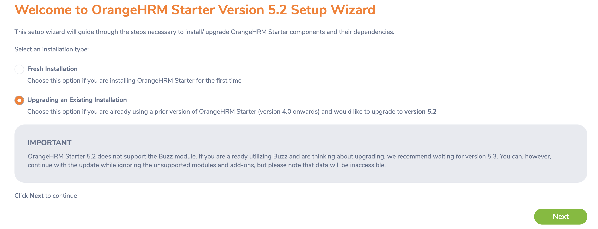
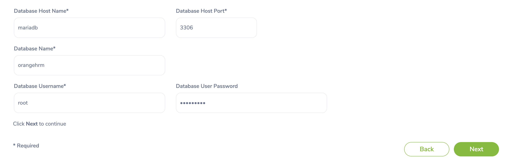
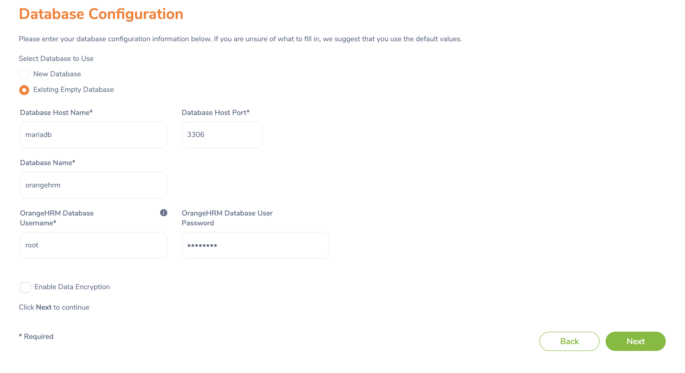

# Introduction

This is the instruction to demo the Database Testing on OrangeHRM

Basically, database testing brings us cabability to check if these circumstances:

- Application really can connect to database
- All functions for database are working well (SELECT, UPDATE, DELETE)
- Running time of a query
Read more [here](https://www.guru99.com/data-testing.html)

There are 2 methods do to the demo

## Method 1: Use the SQL Dump provided by me

Start server

```zsh
docker-compose up
```

Download dumped sql

```url
https://drive.google.com/file/d/1LLexirkJ4tazNxE0v_kgaAvVzQvZTklC/view?usp=share_link
```

Import database

```zsh
mysql -P 3333 -h 127.0.0.1 -u root -p orangehrm < database.sql
```

Setup DB



Input correct DB information



Update cell `ohrm_user#user_password` to

```text
$2y$12$qMJoo0Fpm2rOObLkzEST.OjxBheXdz7scgYmHQ8/P3F03.jeKqUKW
```

Account was

- username: hnkhoi
- password: ftf4xup@ZJY6dab2kne

Use intellij idea to run `DBUnit` folder

## Method 2: Step by Step how I create that DB

### Import easy data

Start server

```zsh
docker-compose up
```

Setup DB



Find correct container id of database then replace with below id

```zsh
docker cp emp_education.csv 29791a0624e6:/emp_education.csv
docker cp education.csv 29791a0624e6:/education.csv
docker cp emp_skill.csv 29791a0624e6:/emp_skill.csv
docker cp skill.csv 29791a0624e6:/skill.csv
docker cp FinalEmployee.csv 29791a0624e6:/Employee.csv
docker cp subunit.csv 29791a0624e6:/subunit.csv
```

ssh to DB container and access to database

```zsh
mysql -u root -p -P 3306 orangehrm
```

Access to dashboard and add a location

Access to dashboard and add a leave type

Run following SQL

```sql
LOAD DATA INFILE '/subunit.csv'
INTO TABLE ohrm_subunit
FIELDS TERMINATED BY ';'
LINES TERMINATED BY '\r\n'
IGNORE 1 LINES
(name,lft,rgt,level);

LOAD DATA INFILE '/Employee.csv'
INTO TABLE hs_hr_employee
FIELDS TERMINATED BY ';'
LINES TERMINATED BY '\r\n'
IGNORE 1 LINES
(employee_id,emp_lastname,emp_firstname,emp_middle_name,emp_nick_name,emp_smoker,emp_birthday,emp_gender,emp_ssn_num,emp_street1,city_code,emp_zipcode,emp_work_telephone,emp_work_email,nation_code,emp_dri_lice_num,emp_dri_lice_exp_date,coun_code,provin_code,joined_date);

LOAD DATA INFILE '/skill.csv'
INTO TABLE ohrm_skill
FIELDS TERMINATED BY ';'
LINES TERMINATED BY '\r\n'
IGNORE 1 LINES
(name,description);

LOAD DATA INFILE '/emp_skill.csv'
INTO TABLE hs_hr_emp_skill
FIELDS TERMINATED BY ';'
LINES TERMINATED BY '\r\n'
(emp_number,skill_id,years_of_exp);

LOAD DATA INFILE '/education.csv'
INTO TABLE ohrm_education
FIELDS TERMINATED BY ';'
LINES TERMINATED BY '\r\n'
IGNORE 1 LINES
(name);

LOAD DATA INFILE '/emp_education.csv'
INTO TABLE ohrm_emp_education
FIELDS TERMINATED BY ';'
LINES TERMINATED BY '\r\n'
IGNORE 1 LINES
(emp_number,education_id,institute,major,year,score,start_date,end_date);

UPDATE hs_hr_employee
SET work_station = FLOOR(RAND()*21+1);

UPDATE hs_hr_employee
SET eeo_cat_code = FLOOR(RAND()*9+1);

INSERT INTO hs_hr_emp_locations(emp_number, location_id)
SELECT emp_number, 1 from hs_hr_employee;

INSERT INTO ohrm_leave_entitlement(emp_number, no_of_days, leave_type_id, from_date, to_date, credited_date, entitlement_type, created_by_id)
SELECT emp_number, 20.000000000000000, 1, '2022-01-01 00:00:00', '2022-12-31 00:00:00', '2022-12-28 07:23:41', 1, 1 FROM hs_hr_employee;
```

### Import images

To get user avatars, I create a Rails repo to get random image from this API

```url
https://thispersondoesnotexist.com/image
```

Start console

```zsh
bin/rails c
```

Run this in rails console

```ruby
PollImagesJob.perform_later
```

Start sidekiq (run as many as you can - 1 session = 1 process to import images)

```zsh
bundle exec sidekiq
```

Finally run this Python script to import images

```zsh
python3 import_images.py
```

### Import leaves day

Run this python script and wait for about 5 hours

```zsh
python3 apply_leave.py
```